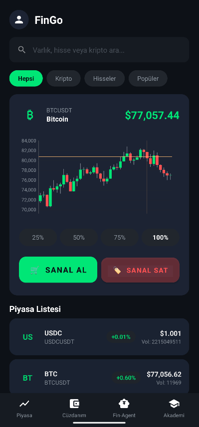
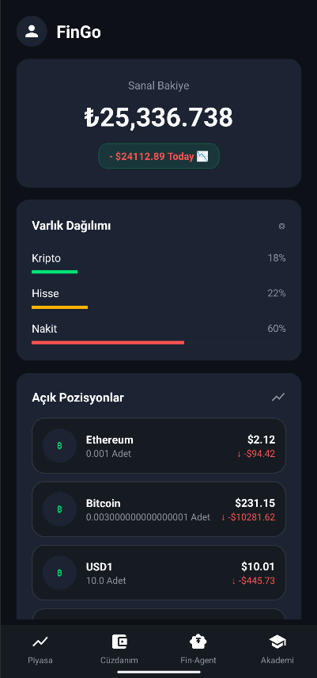
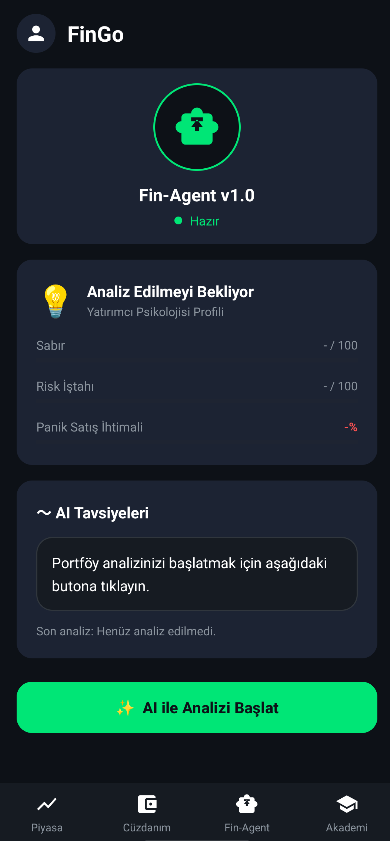
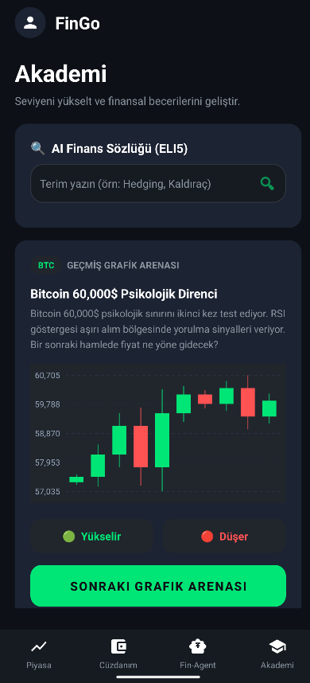

# 🚀 FinGo — Sanal Yatırım & Finansal Yapay Zeka Platformu

<p align="center">
  
</p>

<p align="center">
  <b>FinGo</b>, BTK Hackathon kapsamında geliştirilmiş; gençlerin ve finansal okuryazarlığa adım atmak isteyen herkesin, sıfır riskle ve gerçek zamanlı verilerle sanal yatırımı öğrenebileceği <b>yapay zeka destekli interaktif bir simülasyon ve eğitim platformudur.</b>
</p>

<p align="center">
  
  
  
</p>
## 📱 Uygulama Ekran Görüntüleri (Screenshots)

<p align="center">
  
  
  
  
</p>
## 📱 Uygulama Ekran Görüntüleri (Screenshots)

<p align="center">
  
  
  
  
</p>
---

## 🌟 Öne Çıkan Özellikler

### 1. 📈 Gerçek Zamanlı Sanal Portföy & İşlem Simülasyonu
*   **BIST ve ABD Borsaları:** THYAO, ASELS, Apple, Tesla, Microsoft gibi popüler yerli ve yabancı hisse senetlerinde sanal alım-satım.
*   **Kripto Piyasaları:** BTC, ETH, SOL, BNB, XRP gibi lider kripto paralarla 7/24 işlem yapabilme.
*   **Dinamik Portföy Takibi:** Kar/zarar oranları, toplam varlık dağılımı ve detaylı işlem geçmişinin gerçek zamanlı takibi.

### 2. 🏛️ Grafik Arenası (Geriye Dönük Backtest Simülatörü)
*   Bitcoin 60,000$ Direnci, Tesla FOMO Çılgınlığı gibi **gerçek geçmiş fiyat serilerini** (Double Top, Cup & Handle vb.) içeren 5 farklı simülasyon.
*   Kullanıcının teknik analiz formasyonlarını eğlenceli tahminlerle (YUKARI/AŞAĞI) öğrenebileceği etkileşimli bir oyun.
*   Tahmin sonrasında formasyonun teknik açıklaması ve geriye kalan mum grafik hareketlerinin animasyonlu gösterimi.

### 3. 🧠 AI Finans Sözlüğü (ELI5 — 5 Yaşındakine Anlatır Gibi)
*   **Kişiselleştirilmiş AI Benzetmeleri:** Arbitraj, kaldıraç, hedging veya volatilite gibi karmaşık finansal terimleri yapay zeka (Gemini/Wiro AI) aracılığıyla **5 yaşındaki bir çocuğun anlayabileceği günlük hayat örnekleriyle** açıklama özelliği.

### 4. 🤖 FinAgent AI Danışman & Yatırımcı Davranış Profili
*   Kullanıcının sanal portföyündeki işlem sıklığına, risk tercihlerine ve alım-satım kararlarına göre **gerçek zamanlı psikolojik analiz**.
*   **Sabır Skoru**, **Risk Skoru** ve **Panik Satış İhtimali** gibi metriklerin hesaplanması ve kişiye özel stratejik tavsiyeler.
*   Portföydeki riskli varlıkları otomatik olarak dengeleyen tek tıkla **AI Rebalance** sistemi.

### 5. 📊 Profesyonel Grafik Modülleri & Çoklu Zaman Dilimi
*   TradingView standartlarında özelleştirilmiş, neon renk şemalarına ve akışkan animasyonlara sahip **Candlestick (Mum) Grafik Kütüphanesi**.
*   **15D, 1S, 4S, 1G, 1H** zaman dilimleri arasında tek dokunuşla canlı grafik yenileme ve anlık fiyat sorguları.

---

## 🛠️ Kullanılan Teknolojiler (Tech Stack)

*   **Programlama Dili:** Kotlin
*   **Minimum SDK:** API 26 (Android 8.0)
*   **Ağ Katmanı (Networking):** Retrofit 2 & OkHttp 3 (Asenkron API haberleşmesi & Token Interceptor)
*   **Eşzamanlılık (Concurrency):** Kotlin Coroutines & Lifecycle Scope
*   **Grafik Kütüphanesi:** MPAndroidChart (Özelleştirilmiş Mum & Çizgi Grafik Stilleri)
*   **Tasarım Mimarisi:** Dark Mode öncelikli harmonik HSL renk sistemi, Google Material Design Components, Custom UI Animasyonları.
*   **Yapay Zeka Altyapısı:** Wiro AI & Google Gemini API entegrasyonu (Arka planda FastAPI ile asenkron task yönetimi).

---

## 📦 Kurulum ve Çalıştırma

Projeyi lokal bilgisayarınızda derleyip çalıştırmak için aşağıdaki adımları takip edebilirsiniz:

1.  **Projeyi Klonlayın:**
    ```bash
    git clone https://github.com/KULLANICI_ADINIZ/Fingo.git
    cd Fingo
    ```

2.  **Android Studio ile Açın:**
    Android Studio'yu açıp `Open an Existing Project` seçeneğiyle klonladığınız ana dizini seçin. Gradle senkronizasyonunun tamamlanmasını bekleyin.

3.  **Lokal Sunucu Bağlantısı (İsteğe Bağlı):**
    Uygulama varsayılan olarak canlı sunucumuza (`https://f-ngo-btk-backend.onrender.com/api/v1/`) bağlıdır. Eğer kendi yerel sunucunuzda çalıştırmak isterseniz:
    *   [ApiClient.kt](app/src/main/java/com/example/fingo/network/ApiClient.kt) dosyasındaki `BASE_URL` değişkenini yerel IP adresinizle güncelleyebilirsiniz.

4.  **Çalıştırın:**
    Cihazınızı (fiziksel telefon veya emülatör) bilgisayarınıza bağlayın ve üst menüdeki yeşil **Run** butonuna tıklayarak uygulamayı ayağa kaldırın.

---

## 🤝 Katkıda Bulunma (Contributing)

Bu proje BTK Hackathon kapsamında açık kaynaklı bir eğitim ve geliştirme projesi olarak tasarlanmıştır. Katkıda bulunmak isterseniz:
1. Projeyi forklayın.
2. Yeni bir feature branch açın (`git checkout -b feature/yeniozellik`).
3. Değişikliklerinizi commit edin (`git commit -m 'Yeni özellik eklendi'`).
4. Push işlemini gerçekleştirin (`git push origin feature/yeniozellik`).
5. Bir Pull Request (PR) açın.

---

## 🏆 Teşekkürler

Projemizin geliştirilmesinde desteklerini esirgemeyen tüm BTK Hackathon organizasyon komitesine ve değerli jüri üyelerine teşekkür ederiz. 

<p align="center">
  <b>FinGo — Yatırımın Yapay Zeka Hali! </b>
</p>
